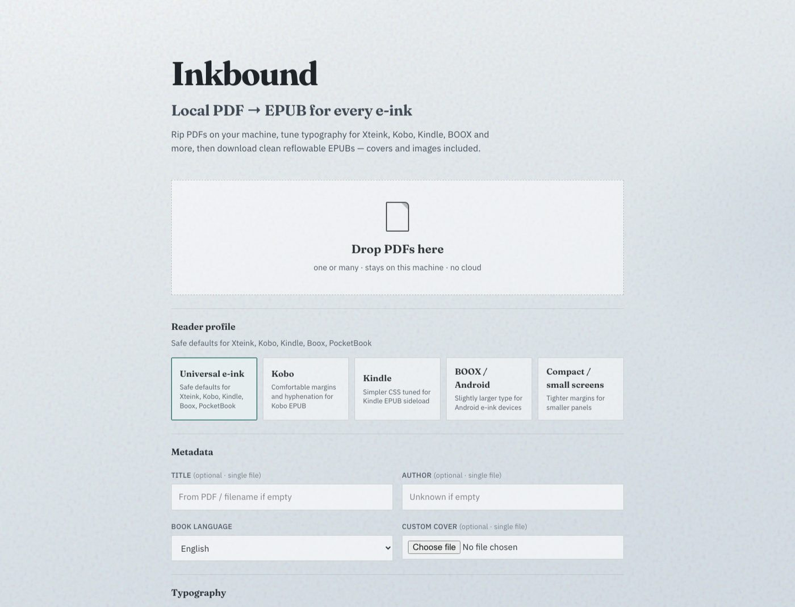
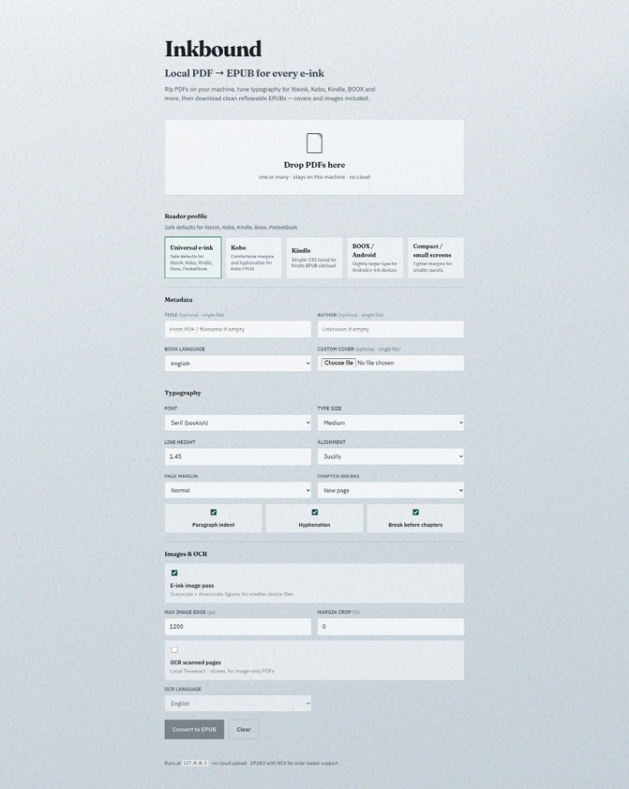
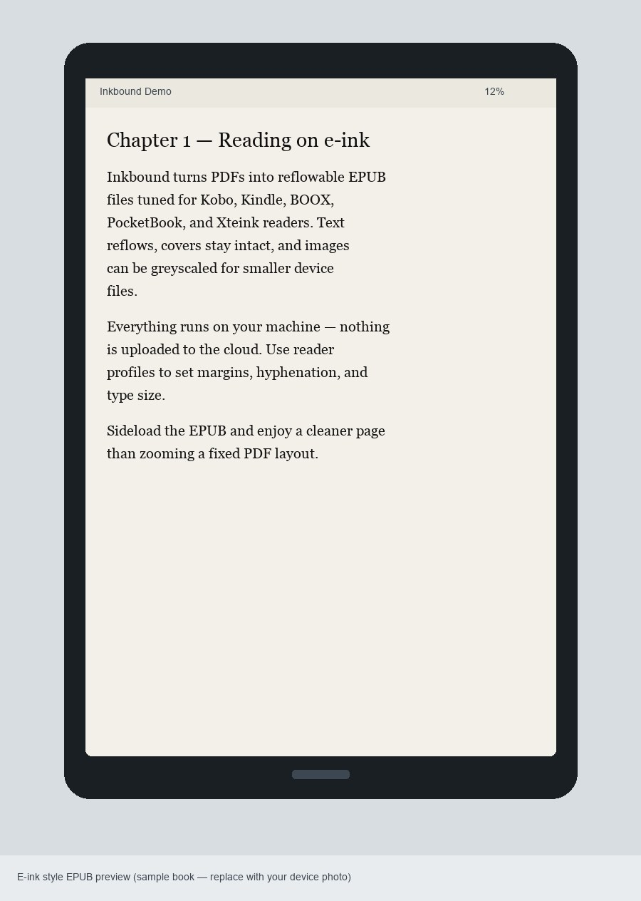

# Inkbound — Local PDF to EPUB Converter for E-Ink Readers

**[🚀 Try Inkbound in your browser (creates a Codespace)](https://codespaces.new/nirmal5307/pdf-to-epub-formater?quickstart=1)**  
No install — after it finishes loading, the app **starts automatically**.

**Inkbound** is a free, open-source, **offline PDF to EPUB converter** built for e-ink devices.  
Convert PDF books into reflowable **EPUB3** files tuned for **Kobo, Kindle, BOOX, PocketBook, Xteink X4**, and other e-readers — with **no cloud upload**.

Drop a PDF → pick a reader profile → download an e-ink-friendly EPUB.  
Also works from the command line for batch conversion.

[](https://codespaces.new/nirmal5307/pdf-to-epub-formater?quickstart=1)
[](LICENSE)
[](https://www.python.org/)
[](#why-inkbound)
[](#features)
[](#language-support)



> Looking for a **PDF to EPUB** tool that keeps books private, preserves covers, supports OCR for scans, and exports CSS that looks good on e-ink? Inkbound is built for that.

---

## Why Inkbound?

| Need | Inkbound |
|------|----------|
| Convert **PDF to EPUB** for sideloading | Yes — EPUB3 + NCX for wide device support |
| Keep files **offline / private** | Yes — nothing leaves your machine (local mode) |
| Try in the browser with no install | Yes — [GitHub Codespaces](#try-in-github-codespaces-no-local-install--easiest) auto-starts the app |
| Optimize for **e-ink readers** | Yes — greyscale images, typography presets |
| Support **Kobo / Kindle / BOOX / PocketBook / Xteink** | Yes — reader profiles with sensible defaults |
| Handle **scanned PDFs** | Optional local **Tesseract OCR** |
| Batch convert many PDFs | Web UI + CLI |

**Keywords people search for:** pdf to epub, pdf to ebook, epub converter, e-ink epub, kobo epub sideload, kindle epub, boox converter, pocketbook epub, offline pdf converter, local ebook converter, tesseract ocr pdf, reflowable epub from pdf, github codespaces ebook tool.

---

## Language support

**Inkbound is English-first today.**

- The web UI is in English  
- Chapter / heading detection is tuned mainly for English books (e.g. “Chapter”, “Part”, “How to…”)  
- Book language + OCR language pickers already exist for many locales  
- **More UI languages and better non-English chaptering are coming soon**

If you read or convert books in another language, we’d love your help — see [Contributing](#contributing--looking-for-help).

---

## Features

- **Reader profiles** — Universal, Kobo, Kindle, BOOX / Android, Compact (small screens)
- **Typography controls** — serif/sans, type size, line height, justify/left, indent, hyphenation, margins, chapter breaks
- **Smart chaptering** — uses TOC when available; prefers Part / “How to…” structure; avoids exploding into page chunks
- **Cover extraction** — PDF page 1 (or a custom cover image) becomes the EPUB cover
- **E-ink image pass** — greyscale + downscale figures; configurable max image edge
- **OCR for scans** — optional Tesseract OCR with language picker
- **Margin crop** — trim page edges (0–20%) before extract
- **Batch mode** — convert multiple PDFs in one go
- **CLI + local web UI** — `./run.sh` or `python -m app.cli`
- **GitHub Codespaces** — one-click cloud try; app auto-starts after the container loads

---

## Screenshots

### Web UI — reader profiles, typography, OCR



### E-ink reading preview



> Have a real device photo? Drop a Kobo / Kindle / Xteink shot into `docs/screenshots/` (e.g. `inkbound-on-device.jpg`) and open an issue or PR — real e-ink photos help everyone.

---

## Quick start (web UI)

### Requirements

- macOS / Linux / Windows (WSL fine)
- Python 3.11+
- Optional: [Tesseract](https://github.com/tesseract-ocr/tesseract) for OCR (`brew install tesseract`)

### Install & run (local / private)

```bash
git clone https://github.com/nirmal5307/pdf-to-epub-formater.git
cd pdf-to-epub-formater
python3 -m venv .venv
source .venv/bin/activate   # Windows: .venv\Scripts\activate
pip install -r requirements.txt
./run.sh
```

Then open **http://127.0.0.1:8765**

### Try in GitHub Codespaces (no local install — easiest)

[](https://codespaces.new/nirmal5307/pdf-to-epub-formater?quickstart=1)

**Works for any GitHub user** (not only the repo owner). Your free GitHub account is enough.

**For first-time users:** you do not need to install Python or run any commands.

1. Click **[Try Inkbound in your browser](https://codespaces.new/nirmal5307/pdf-to-epub-formater?quickstart=1)** (sign in to GitHub if asked)  
2. Wait for the Codespace to finish loading / building (first time can take a few minutes)  
3. When it’s ready, Inkbound **automatically starts and runs** — the web UI opens on port **8765**  
4. Drop a PDF → convert → download your EPUB  

No `./run.sh` needed in Codespaces on first launch.  
Full walkthrough + troubleshooting: **[docs/CODESPACES.md](docs/CODESPACES.md)**

> Codespaces runs in the cloud, so uploads live in that temporary workspace. Prefer fully offline? Use the local install above.

**Once the UI is open (local or Codespaces):**

1. Drop one or more PDFs  
2. Pick a **reader profile** (Universal, Kobo, Kindle, BOOX, Compact)  
3. Tune typography (font, size, line height, alignment, margins, hyphenation, chapter breaks)  
4. Optionally set metadata, OCR, margin crop, and image max edge  
5. Convert → download the EPUB when ready  

If the local port is busy:

```bash
kill $(lsof -tiTCP:8765 -sTCP:LISTEN)
./run.sh
```

---

## CLI — batch PDF to EPUB

```bash
source .venv/bin/activate

# Single file
python -m app.cli book.pdf -o book.epub

# Batch
python -m app.cli a.pdf b.pdf c.pdf

# Scanned PDF → OCR
python -m app.cli scan.pdf --ocr --ocr-lang eng --margin-crop 4

# Metadata + cover
python -m app.cli book.pdf --cover cover.jpg --language en --author "Name"

# Reader presets
python -m app.cli book.pdf --reader-profile kobo --body-size large
python -m app.cli book.pdf --reader-profile kindle --no-hyphenate --text-align left

# Keep original colour images
python -m app.cli book.pdf --no-eink-images
```

### OCR languages

```bash
brew install tesseract
brew install tesseract-lang   # extra languages
tesseract --list-langs
```

---

## Who is this for?

- E-ink owners who **sideload EPUBs** to Kobo, Kindle, BOOX, PocketBook, Xteink, etc.
- Readers who want **reflowable text** instead of zooming a fixed PDF page
- Anyone who wants a **private, local PDF → EPUB** pipeline with no SaaS upload
- People who want to **try in the browser first** via Codespaces, then install locally later

---

## How it works (short)

1. **Extract** text, headings, images, and cover from the PDF (PyMuPDF)  
2. **Split** into chapters using TOC / Part / lesson headings when possible  
3. **Optimize** images for e-ink (optional greyscale + resize)  
4. **Build** an EPUB3 package with NCX + CSS tuned for e-readers  

---

## Tests

```bash
source .venv/bin/activate
pip install -r requirements.txt
pytest -q
```

Covers heading/split heuristics, e-ink CSS options, and the convert API with synthetic PDFs.

---

## Tips for better EPUBs

- Restart `./run.sh` after pulling code so the server loads changes  
- On device, replace/remove the old EPUB if the cover looks cached  
- Text-based PDFs convert best; use OCR for image-only scans  
- Junk PDF metadata (e.g. Word export titles) is ignored in favour of a cleaned filename  
- Books without a TOC no longer explode into hundreds of tiny chapters  
- Self-help / “How to…” books prefer Part + trick TOC over page chunks when possible  

---

## Contributing / looking for help

Inkbound is early and English-first. Contributions are very welcome — especially:

| We’re looking for | Examples |
|-------------------|----------|
| **More languages** | UI translations; chapter words like “Chapitre”, “Kapitel”, “Capítulo”; RTL notes |
| **Test PDFs** | Public-domain / freely licensed sample books that break chaptering, covers, or OCR |
| **Device photos** | Converted EPUB on a real Kobo / Kindle / BOOX / Xteink |
| **Reader feedback** | What CSS / margins / fonts work best on your device |
| **Edge cases** | Multi-column PDFs, comics/manga, textbooks, scanned paperbacks |

Please **do not** upload copyrighted books to issues or PRs. Use public-domain samples, or describe the problem with screenshots / synthetic fixtures.

Open an [issue](https://github.com/nirmal5307/pdf-to-epub-formater/issues) or pull request — even a short “this French PDF splits badly” report helps.

---

## Roadmap

- More UI languages (beyond English)  
- Stronger non-English chapter / Part detection  
- More reader presets (Tolino, etc.)  
- Optional embedded fonts for stubborn devices  
- Better multi-column academic PDF handling  

---

## License

[MIT](LICENSE) — free to use, modify, and share.

---

## Repository topics / search terms

`pdf-to-epub` · `epub-converter` · `ebook-converter` · `e-ink` · `kobo` · `kindle` · `boox` · `pocketbook` · `xteink` · `pdf` · `epub` · `epub3` · `ocr` · `tesseract` · `python` · `offline` · `local-first` · `sideload` · `codespaces` · `github-codespaces`
